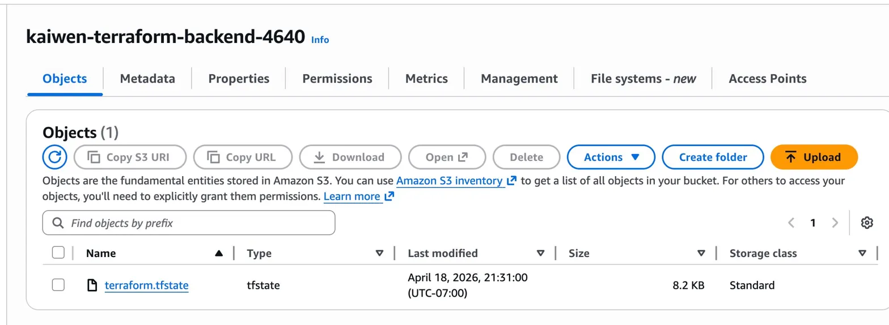
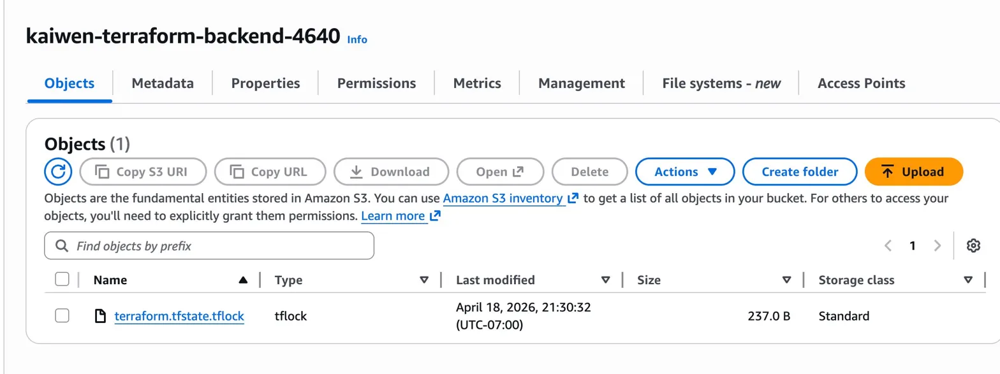

# Terraform S3 Backend Lab

## Questions

**When is the state file created?**
The state file is created after `terraform apply` completes successfully.

**When is the lock file present?**
The lock file is present during the execution of `terraform apply` — it appears while Terraform is actively making changes and disappears once the operation completes.

**Is the lock file always in the bucket after it is created?**
No. The lock file is temporary — it only exists while Terraform is running to prevent concurrent operations. It is automatically removed once the operation completes.

## Screenshots

### State File Only

### Lock File

